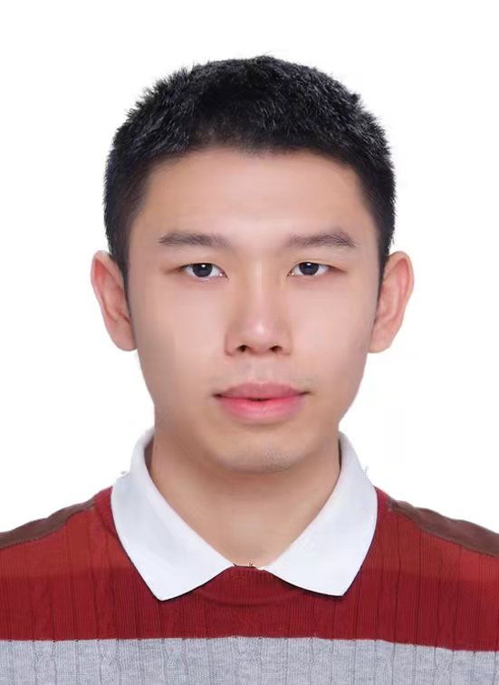

# 黄华津的个人主页

<table border="0">
  <tr>
    <td width="50%">
      <h1>黄华津</h1>
      
<b>博士候选人</b>

      
<b>中国传媒大学</b>

      
<b>Email：cee@cuc.edu.cn</b>

    </td>
    <td width="50%">
       
    </td>
  </tr>
</table>

黄华津，中国传媒大学传播学博士候选人，中国传媒大学国家治理研究院院长助理，于《中国行政管理》、《现代传播》、《学习时报》等报刊发表多篇论文，多次向中央和地方政府部门提交咨政建议、政策内参，部分成果获中央和地方领导肯定批示，有关研究被新华网、网信中国等主流媒体及政府网站转载。

# 学术发表

#### 高慧军 & 黄华津.(2020).全媒体服务的效果与影响因素研究——以省级广电媒体为例. 现代传播(中国传媒大学学报)(09),27-35. doi:CNKI:SUN:XDCB.0.2020-09-007.
#### 高慧军,黄华津 & 吴竞妍.(2020).全媒体在国家治理中的价值及其实现机制. 中国行政管理(12),97-103+137. doi:10.19735/j.issn.1006-0863.2020.12.13.
#### 高慧军 & 黄华津.(2019-11-11).以智慧治理平台推进国家治理现代化.学习时报.
#### 高慧军 & 黄华津.(2019).新时代我国政府公共关系优化研究. 中国行政管理(06),16-21. doi:10.19735/j.issn.1006-0863.2019.06.03.
#### 高慧军 & 黄华津.(2020).加强防汛救灾中的舆论引导. 中国减灾(17),24-27. doi:CNKI:SUN:ZGJI.0.2020-17-008.
#### 高慧军 & 黄华津.(2021).坚持党建引领高效化解物业矛盾. 人民周刊(04),74-75. doi:CNKI:SUN:RMWZ.0.2021-04-036.
#### Wang, L., Wang, K., & Huang, H. (2022). Construction and Analysis of Governance Evaluation Index System of Beijing Urban Subcenter Based on System Theory and Information Theory. Wireless Communications and Mobile Computing, 2022.
#### 王洌瑄,王崑声 & 黄华津.(2022).系统论视野下城市治理的复杂性分析. 计算机仿真(03),1-6+45.
#### 张瑜,程飞,李政蓉,黄华津 & Kalin Grose.（2019）线上线下一体化政务服务用户满意度影响因素研究方案——以上海市“一网通办”为例.数字治理评论.2019

# 学术著作

#### 新时代广电全媒体服务治理创新，高慧军 黄华津 著，中国言实出版社，2020年

# 会议论文

#### Digital Platform and Collaborative Governance Sustainability: A Case Analysis of “Health Code” Policy in China,The Program of the 10th Sino-US International Conference on Public Administration（第十届中美公共管理国际研讨会）,2021
#### Diffusion and learning of national governance innovation in the post epidemic era: policy international diffusion and complex evolution theory,The Program of the 10th Sino-US International Conference on Public Administration（第十届中美公共管理国际研讨会）,2021
#### 新时代政府公共关系优化，第二届融媒体与公共治理论坛，2019
#### 市民广场自主治理研究——以中国深圳市市民中心广场为例，改革开放40年：中国式治理论坛，2018

# 奖学金

#### 2020-2021 博士研究生国家奖学金（National Scholarship for Doctoral Students in China）
#### 2019-2020 中央广播电视总台奖学金（China Media Group Scholarship）
#### 2018-2019 & 2019-2020 & 2020-2021 学业一等奖学金（First class academic scholarship）

# 科普文章

#### 复杂系统自动建模综述：描述、预测与理论发现，集智俱乐部，https://mp.weixin.qq.com/s/I-RH57-4qbSH1N8oAIiMYg
#### 涌现、因果与自指——“因果涌现”理论能否破解生命与意识之谜，集智俱乐部，https://mp.weixin.qq.com/s/Vw4gk-ClD0KqLM1PHnNAww

# 学术活动

#### 《中国社会计算发展报告》研讨会 
#### 中传政院系列讲座|因果关系的新科学与Causal Al

# 新闻实践

#### 2014-2018，北京市朝阳区青年志愿者协会记者团记者
#### 2015-2016，中国传媒大学电视台记者
#### 2020-2022，集智俱乐部内容创作者
